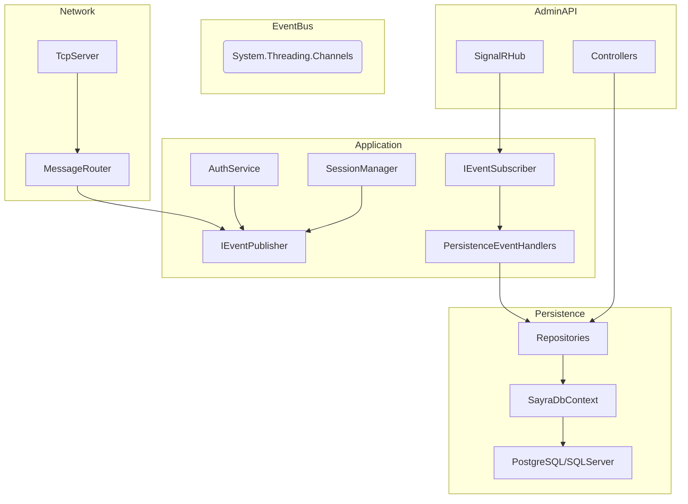

# Phase 3: Production Backend Evolution

## 1. Updated Architecture

## 2. Database Schema (EF Core)

### Clients Table
- **PcId** (PK): string
- **MacAddress**: string
- **Hostname**: string
- **IP**: string
- **Status**: string
- **LastSeen**: DateTime

### Sessions Table
- **SessionId** (PK): string
- **PcId** (FK): string
- **StartTime**: DateTime
- **EndTime**: DateTime?
- **Status**: string
- **Duration**: double (minutes)

### CommandAudits Table
- **CommandId** (PK): string
- **PcId**: string
- **Action**: string
- **Payload**: string
- **Result**: string
- **Timestamp**: DateTime

### Telemetries Table
- **Id** (PK): int (Identity)
- **PcId**: string
- **CPU**: float
- **RAM**: float
- **Uptime**: long
- **Timestamp**: DateTime

### AdminUsers Table
- **AdminId** (PK): string
- **Username**: string (Unique Index)
- **PasswordHash**: string
- **Role**: string

## 3. Event Flow Architecture

The system uses a decoupled, asynchronous event-driven architecture based on `System.Threading.Channels`.

1. **Client Connected**: `MessageRouter` publishes `ClientConnectedEvent`.
2. **Client Authenticated**: `AuthService` publishes `ClientAuthenticatedEvent`.
3. **Session Lifecycle**: `SessionManager` publishes `SessionStartedEvent` and `SessionEndedEvent`.
4. **Command Execution**: Published via `CommandExecutedEvent`.
5. **Telemetry**: Published via `TelemetryReceivedEvent`.

**Subscribers**:
- `PersistenceEventHandlers`: Listens to all core events and persists them to the database via Repositories.
- `AdminHub` (Future): Can listen to events to push real-time updates to connected admin dashboards.

## 4. Admin API Definitions

### Endpoints
- `GET /clients`: List all registered clients.
- `GET /clients/{pcId}`: Get specific client details.
- `GET /sessions`: List all sessions.
- `GET /sessions/{sessionId}`: Get specific session details.
- `POST /commands/send`: (Skeleton) Send command to a client.
- `GET /telemetry/{pcId}`: Get telemetry history for a client.

### SignalR
- Hub Path: `/hubs/admin`
- Events: `OnClientStatusChanged`, etc.
