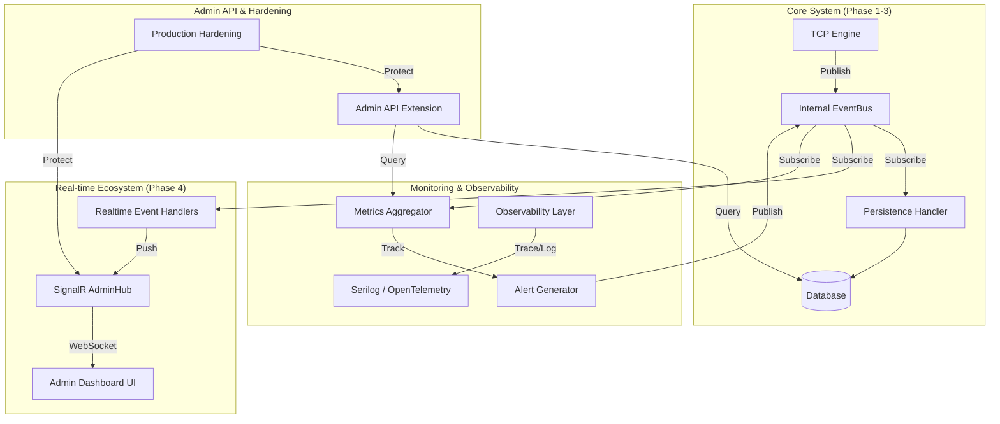

# Sayra Server - Phase 4 Design Document

## 1. Phase 4 Architecture Diagram

## 2. SignalR Event Flow Design

1. **Event Capture**: A core event (e.g., `SessionStartedEvent`) is published to the `InMemoryEventBus`.
2. **Subscription**: `SignalREventHandler` (in `Sayra.Server.Realtime`) receives the event asynchronously.
3. **Dispatch**: The handler calls `IHubContext<AdminHub>` to broadcast the update to the "Admins" group.
4. **Latency**: Direct in-memory handoff ensures < 100ms latency from EventBus to SignalR dispatch.

## 3. Real-time Data Pipeline Architecture

- **Ingress**: TCP payloads -> `MessageRouter` -> `EventBus`.
- **Processing**:
    - `MonitoringModule` maintains in-memory sliding windows for metrics (CPU/RAM).
    - `AlertService` checks thresholds on every telemetry event.
- **Egress**:
    - SignalR for "push" notifications.
    - REST API for "pull" initial dashboard state and historical charts.

## 4. New Module Structure

- **Sayra.Server.Realtime**: SignalR Hubs and bridge between EventBus and SignalR.
- **Sayra.Server.Monitoring**: Health checks, Metrics stores, Alerting logic.
- **Sayra.Server.Observability**: Logging sinks, OpenTelemetry instrumentation.
- **Sayra.Server.ProductionHardening**: Middleware for Rate Limiting, Request Validation, Circuit Breakers.
- **Sayra.Server.AdminAPI**: (Existing/Extended) Aggregated dashboard endpoints.

## 5. Monitoring System Design

- **MetricsAggregator**: Singleton service tracking:
    - Active Connection count (Gauge).
    - Messages per second (Counter).
    - Failed Auth attempts (Counter).
    - Per-client CPU/RAM averages.
- **AlertGenerator**:
    - `ReconnectStorm`: Trigger if > 50 connections in 1s.
    - `HighResourceUsage`: Trigger if client CPU > 90% for 3 telemetry cycles.
    - `DatabaseLatency`: Trigger if DB operations exceed 500ms.

## 6. Production Hardening Strategy

- **Rate Limiting**: IP-based rate limiting for Admin API and SignalR connection attempts.
- **Concurrency**: Limit max concurrent SignalR connections per admin user.
- **Fault Tolerance**:
    - Circuit Breaker on Database repositories using Polly.
    - Fail-safe EventBus: Ensure one failing handler doesn't stop others.
- **Validation**: Strict schema validation for all Admin API inputs.

## 7. Integration Plan

1. **Project Creation**: Add the 4 new projects to `src/`.
2. **Dependency Injection**: Register new services in `Sayra.Server.Core`.
3. **Event Wiring**: Create subscribers in `Realtime` and `Monitoring` for existing `CoreEvents`.
4. **API Extension**: Add `DashboardController` to `AdminAPI` referencing `Monitoring` and `Persistence`.
5. **Hardening**: Apply middleware in `AdminAPI` and `Realtime` startup.
