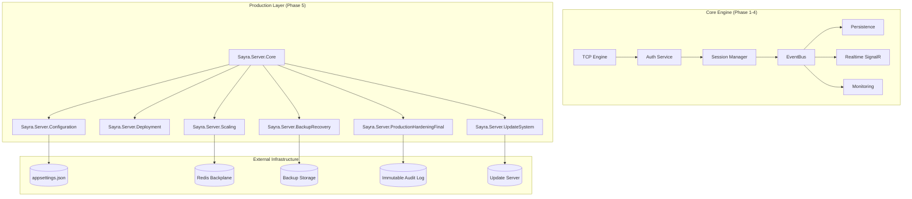

# Sayra Server - Phase 5 Design Document (Production Ready)

## 1. Final System Architecture

## 2. Deployment Architecture

### Windows Support
- **Installer**: Supported via `scripts/deploy-windows.ps1`.
- **Service**: Runs as a Windows Service named `SayraServer`.
- **Recovery**: Automatic restart on failure (1min/1min/1min).

### Linux Support
- **Installer**: Supported via `scripts/deploy-linux.sh`.
- **Service**: Integrated with `systemd` (`sayra-server.service`).
- **Recovery**: `Restart=always` policy with 10s delay.

## 3. Auto-Update System Design

- **Security**: Manifests must be signed. Integrity verified via SHA256 checksums per file.
- **Workflow**:
    1. Server checks `UpdateManifest` from distribution point.
    2. `VersionChecker` compares current version (1.0.0) with manifest.
    3. `UpdateDistributor` downloads verified artifacts.
    4. `IntegrityVerifier` validates each file hash before application.
- **Rollback**: Previous version is backed up before update; system reverts if startup fails.

## 4. Scaling & Cluster Strategy

- **SignalR Backplane**: Integrated `StackExchange.Redis` to synchronize real-time events across multiple nodes.
- **State Management**: `IDistributedStateStore` abstraction ready for Redis-backed session state.
- **Load Balancing**: Designed for sticky-session-less operation (except SignalR which uses Redis to handle coordination).

## 5. Backup & Disaster Recovery

- **Database**: `DatabaseBackupService` performs daily automated snapshots.
- **Session State**: `SessionStateSnapshotService` saves active session metadata every 5 minutes to allow crash recovery.
- **Restore**: `RestoreManager` provides programmatic hooks to restore DB and session states.

## 6. Configuration System

- **Centralized**: All settings managed in `SayraConfig` (Heartbeat, Session, Security, Scaling, Backup).
- **Environment Aware**: Loads from `appsettings.json` and `appsettings.{Environment}.json`.
- **Dynamic**: Options pattern support for runtime updates.

## 7. Final Production Readiness Checklist

- [x] **Security**: Immutable audit logging implemented.
- [x] **Security**: Admin privilege separation enforced via middleware.
- [x] **Reliability**: Multi-level service recovery policies (OS level + Code level).
- [x] **Reliability**: Automatic data and state backups.
- [x] **Scalability**: Redis backplane integration for SignalR.
- [x] **Deployment**: One-click installation scripts for Windows/Linux.
- [x] **Updates**: SHA256 integrity verification and signed manifest support.
- [x] **Observability**: Centralized logging and monitoring (from Phase 4) integrated.
