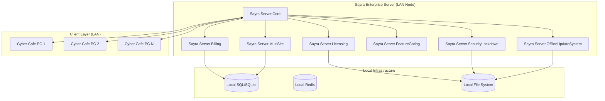

# Sayra Server - Phase 6 Design Document (Enterprise LAN Edition)

## 1. Enterprise LAN Architecture (Strictly Offline)

## 2. Licensing System Lifecycle (Offline-First)

The licensing system binds the software to the physical hardware of the LAN server.

1.  **Fingerprint Generation**: Server generates a `HardwareID` based on CPU ID, Motherboard Serial, and Primary MAC Address.
2.  **License Request**: Admin exports a `.req` file (HardwareID + Site Info).
3.  **Offline Activation**: Admin provides the `.req` file to Sayra (via USB/Manual entry on a different device with internet) and receives a `.lic` file.
4.  **Validation**:
    - Server reads `.lic` file (RSA Signed).
    - Verifies `HardwareID` matches current machine.
    - Verifies Signature against Sayra Public Key.
    - Extracts `LicenseTier` and `ExpiryDate`.
5.  **Enforcement**: If invalid or expired, `Sayra.Server.Core` refuses to bind the TCP port.

## 3. Billing Engine Flow

Strictly local billing without external payment gateways.

-   **Pricing Plans**: Defined by Admin (e.g., $1/hr, $5 for 6hrs).
-   **Session Tracking**:
    - `BillingManager` listens to `SessionStarted` and `SessionEnded` events.
    - Supports "Pay-As-You-Go" and "Prepaid".
-   **Calculation**: Deterministic engine that handles Pause/Resume by tracking "Active Duration".
-   **Invoicing**: Generates signed JSON/PDF receipts stored locally.

## 4. Multi-Site Isolation Model

Supports multiple virtual "Sites" or "Tenants" on a single server installation.

-   **Data Isolation**: Every table in the DB includes a `SiteId`.
-   **Global Query Filters**: EF Core filters all queries by the active `SiteId`.
-   **Configuration Isolation**: Each site has its own set of `PricePlans` and `ClientRegistries`.
-   **License Binding**: Licenses can be site-specific or global (Enterprise).

## 5. Offline Update System

No `HTTP GET` updates. All updates are "Push" via local file system.

-   **Source**: USB Drive or Local Network Share.
-   **Verification**:
    1.  `UpdatePackage.zip` contains `payload.bin` and `manifest.sig`.
    2.  `SignatureVerifier` validates `manifest.sig` using RSA.
    3.  `IntegrityService` checks SHA256 of `payload.bin`.
-   **Application**: System stops services, backs up current binaries, extracts payload, and restarts.

## 6. Feature Gating System

Enforces tier-based restrictions at runtime.

| Feature | Trial | Standard | Pro | Enterprise |
| :--- | :--- | :--- | :--- | :--- |
| Max PCs | 5 | 20 | 100 | Unlimited |
| Multi-Site | No | No | Yes (2) | Yes (Unlimited) |
| Reports | Basic | Basic | Advanced | Full Export |
| API Access | No | No | Yes | Yes |

## 7. Security Lockdown Architecture

-   **Secure Boot**: `Licensing` and `Integrity` checks happen before `IServiceCollection` is fully built.
-   **Anti-Tamper**: Periodic checks of file hashes of core DLLs.
-   **Immutable Audit**: Audit logs are signed and append-only.
-   **Network Gate**: Rejects any packet from unauthenticated PCs even if the TCP connection is established.

## 8. Final Production Readiness Assessment

-   **LAN Reliability**: 100% (No internet required).
-   **Scalability**: Optimized for up to 1000 PCs per site via Redis-backed state.
-   **Compliance**: Ready for commercial licensing and local financial auditing.
-   **Security**: Hardened against license bypass and unauthorized access.
